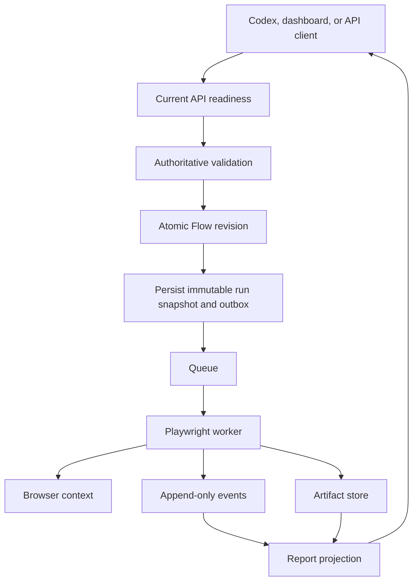

# Architecture overview

Browser interaction is governed by the [capability-grounding authority](semantic-grounding.md). Public Flow contracts describe required behavior and supporting evidence, never authored locators.



## Planned workspace boundaries

```text
apps/
  api/          NestJS API and SSE
  web/          React dashboard
  worker/       Playwright/BullMQ worker
  mcp/          MCP adapter over the API
packages/
  contracts/    Protocol and API schemas
  executor/     Deterministic action interpreter
  policy/       Plan and runtime policy enforcement
  artifact/     ArtifactStore interface and implementations
```

## Invariants

1. A run references an immutable plan and execution configuration snapshot.
2. A logical run may have multiple attempts; attempts never overwrite each other.
3. Events are append-only and monotonically sequenced within an attempt.
4. The worker revalidates the plan and policy immediately before execution.
5. Reports are projections of stored facts, not the primary execution record.
6. Exact rerun does not call an AI or change the stored plan.
7. Large artifacts are referenced by metadata rather than embedded in API or MCP responses.
8. An active Flow cannot exist without a complete executable revision.
9. API, MCP, and worker must report one compatible release before accepting work.
10. A Privacy Gate controls every evidence producer; evidence cannot redefine action truth.
11. Protected work is atomic and recording resumes only after an explicit safe boundary.

## Current domain model

```text
Project
├── Mission
│   ├── Objective
│   ├── Agent session
│   ├── Activity and causal relations
│   ├── Flow and Run associations
│   ├── Accepted evidence
│   ├── Resume pointer
│   └── Immutable Mission report revisions
├── Environment
│   ├── base origin
│   ├── execution policy
│   └── secret references
├── Flow
│   └── Flow revision
│       ├── specification
│       ├── executable plan
│       └── validation record
└── Run
    └── Attempt
        ├── Step result
        ├── Assertion result
        ├── Event
        └── Artifact
```

Mission is the authoritative boundary for user-directed work. A Flow remains a reusable definition and may be linked to many Missions; a Run belongs to exactly one Mission and Objective. Reports are published only from explicitly accepted evidence and never synthesize an execution that did not occur.
