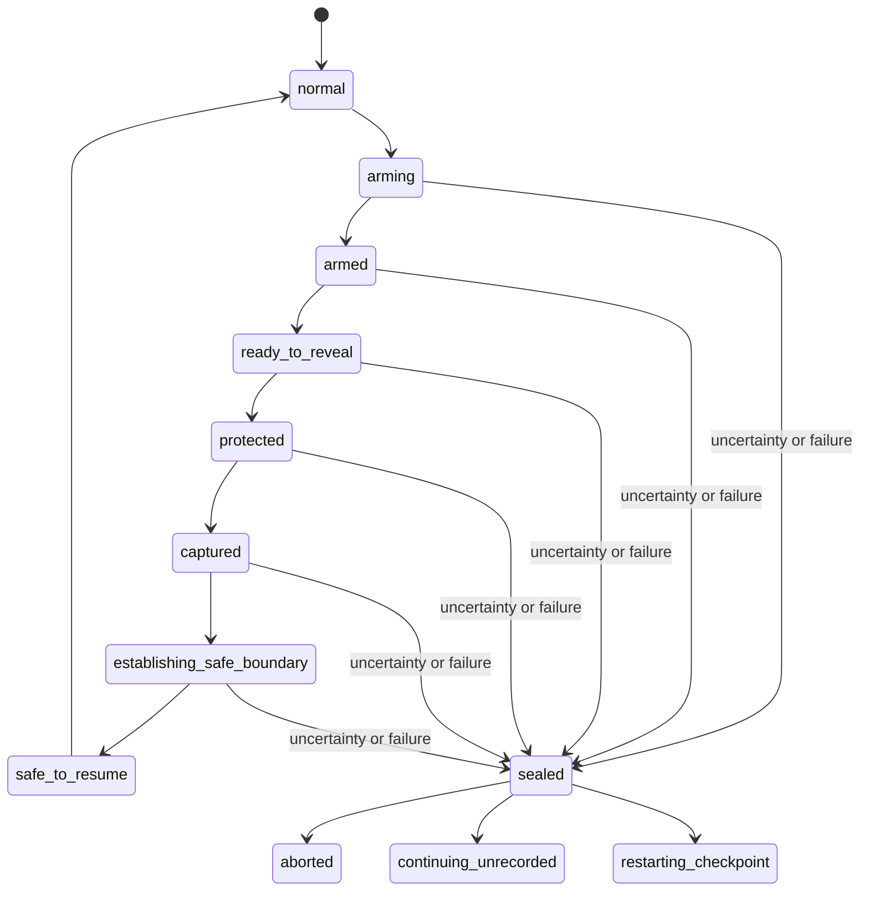

# Privacy foundation

## Security invariant

A secret may exist in browser memory and encrypted credential storage only. It
must never enter an evidence frame, trace event, DOM snapshot, network artifact,
console record, diagnostic, event payload, filename, or returned API body.

Recording is evidence. It is not required for browser execution and it is not a
privacy control by itself.

## Protected-operation lifecycle

No transition into `protected` is permitted until every evidence producer has
acknowledged the Privacy Gate. No transition back to `normal` is permitted until
the declared safe-resumption boundary is observed.

## Coordinators

- Recording Coordinator starts and stops page screencasts, segments recordings,
  and emits an explicit timeline of recorded and omitted intervals.
- Trace Coordinator starts, stops, and withholds trace segments independently of
  the browser action lifecycle.
- Privacy Gate is the sole authority for admitting data to every artifact and
  diagnostic channel.
- Protected Operation performs the mutation and capture atomically under the
  gate. Unknown generated secrets execute only in a separate evidence-free browser capsule. The capsule is destroyed on success, cancellation, navigation uncertainty, crash, and timeout; cleanup or value-absence scans never authorize recording.

## Independent result channels

A step result records action, readiness, assertions, and each evidence request
independently. Failed evidence can degrade evidence but cannot rewrite a passed
action or assertion. Privacy uncertainty is typed as a privacy failure and Scry
dependency failure is typed as infrastructure failure.

## Phase 0 acceptance gates

- One current plan schema exists without a feature-generation discriminator.
- One atomic protected-operation schema requires a safe-resumption boundary.
- The privacy state and result schemas reject impossible success claims.
- Flow revision invariants and the clean baseline schema are documented.
- CI rejects versioning and overlay-era concepts from the new foundation.
- No data is deleted in this phase.

The Phase 1 implementation and feasibility boundary are recorded in
`screencast-feasibility.md`.
