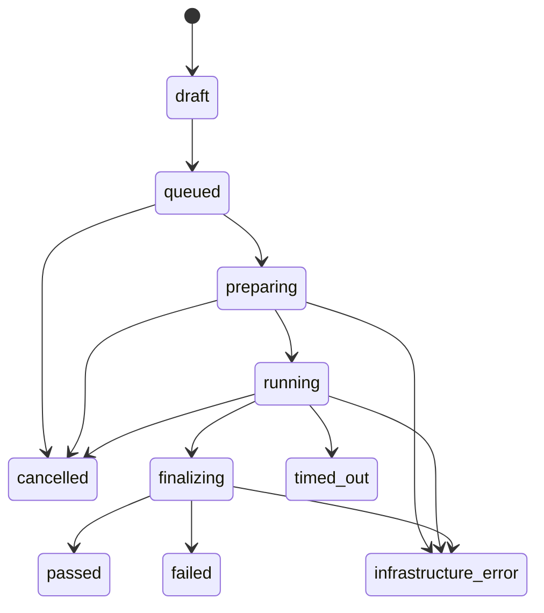

# Run lifecycle

## Run states

Terminal states are `passed`, `failed`, `cancelled`, `timed_out`, and
`infrastructure_error`.

## Outcome meanings

- `passed`: every required assertion passed.
- `failed`: execution completed far enough to establish at least one failed required assertion.
- `cancelled`: a user or authorized client requested termination.
- `timed_out`: an execution budget expired.
- `infrastructure_error`: Scry could not reliably determine the product outcome.

Product failure and infrastructure failure must never be conflated.

## Run versus attempt

A run represents the user's requested test. An attempt represents one worker
claim and execution. A retry creates a new attempt. The report identifies the
selected/latest attempt while retaining all earlier attempts and artifacts.

## Event ordering

Each attempt uses a database-assigned monotonic sequence number. Consumers can
reconnect with `afterSequence` and receive missed events before subscribing to
live events.

## Cancellation

Cancellation is cooperative but bounded:

1. Mark cancellation requested.
2. Notify the worker.
3. Stop accepting new actions.
4. Close page/context/browser.
5. Finalize available trace/video.
6. Persist a terminal attempt state.
7. Fence late updates from the old worker claim.
