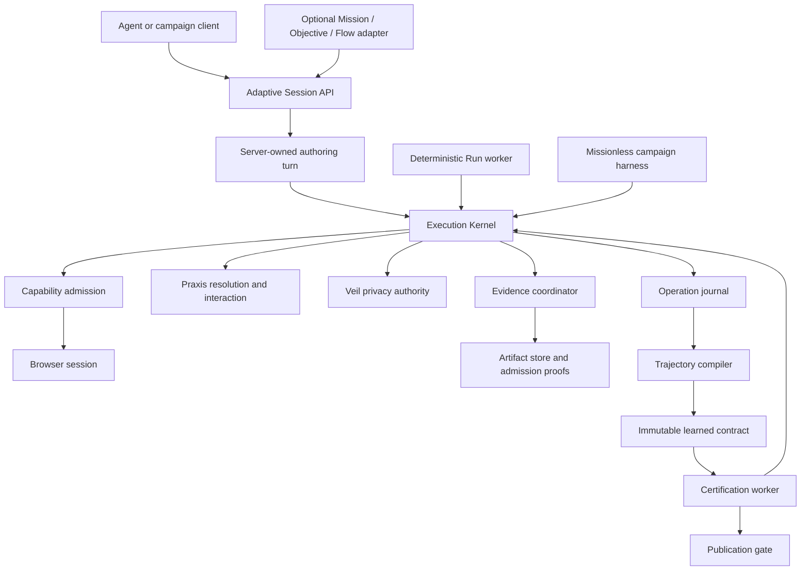

# Adaptive Execution Foundation: M0-M5 Implementation Runbook

Status: approved architecture and implementation handoff  
Date: 2026-08-08  
Implementation owner: Kimi  
Architecture and acceptance owner: Codex  
First implementation assignment: M0 and M1 only

## 1. Directive

This is a subsystem correction, not another sequence of campaign-specific fixes.

Scry must retain deterministic, policy-controlled execution while recovering the adaptability and speed required for real application testing. The implementation must produce one authoritative execution lifecycle, a mission-independent adaptive session, concise agent decision boundaries, reliable evidence, and immutable replay contracts.

The first Kimi assignment is limited to M0 and M1. Kimi must stop after completing the M1 handoff report. Codex will review the changes and run both acceptance campaigns before authorizing M2.

No milestone is complete because its unit tests pass. Every milestone has two independently scoped campaigns:

1. A self-hosted, production-shaped campaign that exercises real Scry components.
2. A narrow Vitract Preview campaign that proves the milestone behavior on a real external application.

The Vitract target is `https://preview.vitract.com`. References to Stripe in older plans or fixtures are obsolete and must be interpreted as Vitract Preview only.

## 2. Why Foundational Work Is Required

The current system has accumulated multiple execution-shaped lifecycles:

- deterministic Run execution;
- queued Probe execution;
- calibration rehearsal;
- candidate and certification Runs;
- an interactive authoring browser owner;
- direct executor campaigns;
- MCP orchestration over Mission, Objective, draft, Probe, compilation, publication, and Run records.

These paths share concepts but do not share one dependency-complete composition root. The confirmed example is the protected transaction path: the Run processor constructs durable protected transaction dependencies, while the Probe processor does not. The same authored operation can therefore be valid in one lifecycle and impossible in its sibling lifecycle.

The missing invariant is:

> Every browser operation, regardless of whether it is observing, rehearsing, transacting, certifying, or replaying, must execute through one kernel that receives the same required capability bundle and records the same authoritative operation outcome. Mode may narrow permissions, but it may not change the availability of required infrastructure.

The agent latency problem has the same ownership defect. The MCP client currently coordinates too many internal state transitions and repeatedly asks the model to reconstruct context that Scry already owns. A fast browser interaction still produces a slow user journey when the agent must perform many reads, plan rewrites, probes, polls, compilations, and retries.

The Run-detail evidence problem is also lifecycle-wide. Evidence is produced, admitted by Veil, persisted, projected by `RunObservation`, fetched through authenticated artifact APIs, and rendered by the web client. A failure at any boundary currently appears as an empty or generic UI state, while internal Veil and Praxis records dominate the page.

## 3. Evidence Ledger

This ledger distinguishes proven facts from implementation hypotheses. Kimi must preserve this distinction in code comments, tests, and completion reports.

| ID   | Status                     | Evidence                                                                                                                                                                                                                                                           | Consequence                                                                                                       |
| ---- | -------------------------- | ------------------------------------------------------------------------------------------------------------------------------------------------------------------------------------------------------------------------------------------------------------------ | ----------------------------------------------------------------------------------------------------------------- |
| E-01 | Proven                     | `apps/api/src/workers/processors/run.processor.ts` supplies protected transaction stores, capture, checkpoint, calibration, provenance, and recovery dependencies. `apps/api/src/workers/processors/probe-calibration.processor.ts` supplies a smaller option set. | A valid protected operation can fail only because it ran through the Probe lifecycle.                             |
| E-02 | Proven                     | `apps/api/src/workers/authoring-runtime-owner.ts` owns a command-polling interactive browser lifecycle separate from Probe and Run workers.                                                                                                                        | Browser ownership, failure semantics, and observation persistence can drift.                                      |
| E-03 | Proven                     | Current MCP authoring requires Mission/Objective/draft/Probe/compile/publish/Run coordination.                                                                                                                                                                     | The agent pays repeated model and network round trips for internal Scry transitions.                              |
| E-04 | Proven                     | `apps/web/src/features/runs/run-report-view.tsx` renders full Veil and Praxis panels before observation integrity, protected operation status, metrics, execution timeline, and captured evidence.                                                                 | Internal diagnostics are the first and largest Run-detail content instead of user outcomes and proof.             |
| E-05 | Proven                     | `packages/executor/src/trace-coordinator.ts` destroys sanitized traces as `TRACE_CLASSIFICATION_UNPROVEN` when `admitSanitized` is absent. `packages/executor/src/executor.ts` constructs it without that verifier.                                                | Ordinary trace output cannot be admitted on this composition path.                                                |
| E-06 | Proven                     | `packages/executor/src/recording-coordinator.ts` maps the general segment finalization catch path to `SEGMENT_VALIDATION_FAILED` and seals recording.                                                                                                              | Permit, binding, checkpoint, media, filesystem, and admission failures are indistinguishable in safe diagnostics. |
| E-07 | Proven                     | Recent Run UI shows `SEGMENT_VALIDATION_FAILED`, no screenshots, and quarantined traces.                                                                                                                                                                           | The evidence experience is unusable even when functional interactions succeeded.                                  |
| E-08 | Proven                     | Screenshot artifacts are step-intent driven. The web empty state says evidence is still finalizing even for terminal Runs with no screenshot intent or a terminal capture failure.                                                                                 | The UI can misstate a deliberate absence or terminal failure as transient work.                                   |
| E-09 | Proven                     | `RunObservationService` is the canonical public Run detail model, and artifact bytes are a separate authenticated resource.                                                                                                                                        | Evidence repair must preserve this authority instead of reconstructing truth in the client.                       |
| E-10 | Inference to measure in M0 | Agent-visible latency is dominated by decision-boundary count and orchestration round trips, not individual Praxis execution time.                                                                                                                                 | M0 must measure boundary and round-trip latency separately before M1 changes behavior.                            |
| E-11 | Proven                     | Recording and trace transition timeouts use `Promise.race`, but the underlying Playwright operation is not cancelled.                                                                                                                                              | A timed-out start/stop can finish after cleanup, leaving unowned capture or late-written bytes.                   |
| E-12 | Proven                     | `persistReport` uploads artifact bytes before persisting the artifact manifest and later persists the timeline separately.                                                                                                                                         | Database failure can leave unowned stored bytes or a partially committed evidence graph.                          |
| E-13 | Proven                     | `RunObservationService` reads most evidence from the latest attempt but reads protected transactions and credential incidents by Run ID.                                                                                                                           | A retry can display operations from one attempt beside steps and evidence from another.                           |
| E-14 | Proven                     | Timeline-only unavailable recording intervals do not contribute to Veil findings/gaps, and evidence health is derived primarily from artifact rows.                                                                                                                | A Run can report Veil verified while recording is unavailable.                                                    |
| E-15 | Proven                     | `AuthenticatedArtifact` and `AuthenticatedVideo` do not render rejected artifact fetches, while `RecordingPlaylist` does. Initial Run-detail load errors are also hidden behind the skeleton.                                                                      | Several retrieval failures become permanent loading states instead of honest terminal UI.                         |

## 4. Non-Negotiable Invariants

### 4.1 Execution

1. One `ExecutionKernel` owns browser operation execution for every mode.
2. Execution modes are policy profiles over one kernel, not separate executors.
3. An operation is admitted only with a complete, typed capability bundle.
4. Missing infrastructure fails at admission before browser mutation.
5. Every mutation has a durable idempotency identity and typed mutation outcome.
6. `unknown` mutation state is terminal until reconciliation; automatic retry is forbidden.
7. Functional result, evidence health, privacy result, and quality findings remain independent channels.
8. Existing immutable Flow revisions remain executable during migration.

### 4.2 Adaptive authoring

1. A Mission, Objective, and Flow are optional control-plane metadata, not execution prerequisites.
2. The server owns repetitive observe-resolve-execute-verify-journal work.
3. The agent is called only at a true semantic decision boundary.
4. The agent supplies objectives, constraints, approvals, and corrections; it never supplies selectors, browser handles, arbitrary JavaScript, secret values in plans, or acquisition code.
5. Authoring success produces an append-only safe trajectory.
6. Only successful, fully verified trajectory entries may become learned interactions.
7. A compiled contract is immutable, versioned, and replayable without the authoring agent.
8. Publication requires a fresh certification Run bound to the exact compiled contract.

### 4.3 Veil and evidence

1. No evidence bytes become readable without a valid Veil admission proof.
2. Protected values never enter screenshots, video, traces, DOM, network evidence, logs, reports, or agent-visible output.
3. Every requested evidence channel reaches one terminal state: `available`, `suppressed`, `quarantined`, or `failed`.
4. A terminal Run never presents a terminal evidence state as "still finalizing."
5. Available video and trace artifacts have authoritative timeline entries; timeline references always resolve.
6. Privacy refusal and Scry evidence failure are distinct classifications.
7. Evidence failure does not silently become an application failure.
8. A timed-out capture transition cannot remain active, write late bytes, or become admitted after the coordinator seals.
9. Every stored artifact is referenced by one retention-owned manifest, or its bytes are synchronously/compensatingly destroyed.
10. A terminal attempt is published to `RunObservation` only after its evidence manifest and timeline reach a consistent terminal commit.
11. Attempt-scoped and Run-scoped evidence are never merged without explicit attempt identity.

### 4.4 User experience

1. Run outcome, tested behavior, protected operation status, and captured evidence precede internal engine diagnostics.
2. Veil lifecycle details, Praxis transactions, raw policy digests, and low-level diagnostics are under one collapsed `Advanced` disclosure by default.
3. Evidence-impacting warnings remain visible next to the evidence they affect, with concise user-facing language.
4. Advanced details remain accessible for operators and support deep links without dominating normal use.
5. The web client renders the canonical `RunObservation`; it does not infer hidden execution state from events.

## 5. Non-Goals

- Do not restore arbitrary JavaScript execution or unrestricted browser control.
- Do not weaken Veil admission to make artifacts visible.
- Do not let the model choose raw selectors, coordinates, credentials, or protected acquisition implementations.
- Do not rewrite existing published Flow revisions.
- Do not make Missions disappear from the product; make them optional wrappers.
- Do not optimize by hiding work from telemetry or combining unrelated outcomes.
- Do not count Vitract application latency as Scry orchestration latency.
- Do not perform live-mode Vitract mutations without explicit authorization at verification time.
- Do not embed Vitract credentials in source, fixtures, reports, snapshots, or shell history.

## 6. Target Architecture



### 6.1 Core types

The exact names may follow existing conventions, but the boundaries are required.

```ts
type ExecutionMode = "observe" | "rehearse" | "transact" | "certify" | "run";

type ExecutionCapabilityBundle = {
  browser: BrowserCapability;
  praxis: PraxisCapability;
  veil: VeilCapability;
  evidence: EvidenceCapability;
  journal: OperationJournalCapability;
  protectedOperations?: ProtectedOperationCapability;
  checkpoint?: CheckpointCapability;
  calibration?: CalibrationCapability;
};

type ExecutionRequest = {
  sessionId: string;
  operationId: string;
  mode: ExecutionMode;
  intent: InteractionIntent;
  expectedEffect: ExpectedEffect;
  policy: ExecutionPolicy;
  capabilityManifestDigest: string;
  idempotencyKey?: string;
};

type OperationOutcome = {
  functionalResult: "succeeded" | "failed" | "inconclusive";
  mutationOutcome: "not_applied" | "applied" | "unknown";
  privacyResult: "verified" | "degraded" | "sealed";
  evidenceResult: EvidenceChannelOutcome[];
  qualityFindings: PraxisQualityFinding[];
  learnedRecord?: LearnedInteractionRecord;
  nextDecisionBoundary?: AgentDecisionBoundary;
};
```

`OperationOutcome` is the authoritative boundary between deterministic Scry work and agent reasoning. Prose summaries are presentations of these fields, not substitutes for them.

### 6.2 Server-owned authoring turn

An authoring turn performs a bounded loop:

1. Load the current safe session state once.
2. Observe the current document if the observation is stale.
3. Resolve candidates from the semantic intent.
4. Select automatically only when confidence and policy thresholds admit one candidate.
5. Execute through the kernel.
6. Verify the expected effect and mutation state.
7. Persist the operation outcome and learned record, when eligible.
8. Continue while the next operation is deterministic and within budget.
9. Return only at a typed decision boundary.

Valid decision boundaries include:

- ambiguous candidate requiring semantic clarification;
- authorization required;
- protected input binding required;
- unknown mutation requiring reconciliation;
- environment or policy refusal;
- objective completed;
- bounded turn budget exhausted.

Normal observation refresh, candidate ranking, safe readiness waits, and durable journaling are not agent decision boundaries.

## 7. Campaign Contract

### 7.1 Harness location and ownership

Create a reusable workspace package at `packages/campaigns` unless repository constraints discovered during M0 prove that an existing package can own the same boundary without circular dependencies.

Minimum structure:

```text
packages/campaigns/
  package.json
  src/contracts.ts
  src/runner.ts
  src/gates.ts
  src/metrics.ts
  src/redaction.ts
  src/report.ts
  src/fixtures/
  test/
apps/api/scripts/
  adaptive-core-campaign.ts
  adaptive-vitract-campaign.ts
scripts/
  verify-adaptive-milestone.mjs
```

The harness may call an in-process core composition for fast component proof and a deployed HTTP composition for production-shaped proof. The release gate must use the deployed composition: API, worker, Postgres, Redis, browser runtime, artifact store, and web client where the milestone includes UI.

### 7.2 Campaign result schema

Every campaign emits one sanitized JSON result and exits nonzero when a required check fails.

```ts
type MilestoneCampaignResult = {
  schemaVersion: 1;
  campaignId: string;
  milestone: "M0" | "M1" | "M2" | "M3" | "M4" | "M5";
  target: "production_shaped" | "vitract_preview";
  releaseId: string;
  startedAt: string;
  completedAt: string;
  requiredChecks: CampaignCheck[];
  observationalChecks: CampaignCheck[];
  futureScope: CampaignCheck[];
  metrics: CampaignMetrics;
  artifactRefs: string[];
  verdict: "pass" | "fail";
};
```

Rules:

- `requiredChecks` alone determine the milestone verdict.
- `observationalChecks` record current behavior but cannot fail the milestone.
- `futureScope` records failures assigned to later milestones.
- A required check cannot be skipped. Missing prerequisites fail with a typed infrastructure or configuration reason.
- Reports never include credentials, tokens, API secrets, cookies, protected values, raw DOM containing secrets, or unrestricted request/response bodies.
- Campaign output is append-only and bound to release ID, schema fingerprint, runtime version, and git commit.

### 7.3 Metrics

Measure at least:

- total wall-clock duration;
- agent decision-boundary count;
- MCP request count;
- API request count;
- model/client idle time when observable;
- queue wait;
- browser startup;
- document observation;
- Praxis grounding and candidate resolution;
- interaction execution;
- readiness and expected-effect verification;
- evidence capture and finalization;
- artifact upload and retrieval;
- compilation and certification;
- retries grouped by typed reason;
- bytes returned to the agent;
- repeated reads of unchanged state.

Do not report only averages. Emit count, p50, p95, max, and the slowest operation IDs with safe phase labels.

### 7.4 Credentials and live-target safety

- Kimi must not run Vitract Preview campaigns.
- Codex owns Vitract execution after code review.
- Read credentials only from environment or the encrypted Scry credential store.
- Never print credential environment variables.
- Default Vitract mode is read-only.
- Test Mode mutations require an explicit per-campaign authorization record and idempotency key.
- Live Mode mutations are forbidden unless the user separately authorizes the exact action during that verification run.
- Campaign cleanup must be explicit. A cleanup failure is reported and cannot be hidden by an otherwise passing campaign.

## 8. Milestone Overview

| Milestone | Purpose                                                                                                         | Primary gate                                                                                                                |
| --------- | --------------------------------------------------------------------------------------------------------------- | --------------------------------------------------------------------------------------------------------------------------- |
| M0        | Establish missionless campaign harness and an honest latency/correctness baseline.                              | Both baselines run and produce comparable, redacted phase metrics.                                                          |
| M1        | Introduce one execution kernel and a server-owned authoring turn that drastically reduces agent back-and-forth. | Sibling modes have capability parity and the scoped journey uses at least 70% fewer agent/MCP decision round trips than M0. |
| M2        | Repair evidence integrity and make Run detail user-first, with Veil/Praxis internals under Advanced.            | Required evidence is available or honestly classified; UI ordering and disclosure behavior pass browser verification.       |
| M3        | Introduce durable, mission-independent Adaptive Sessions and trajectories.                                      | A real journey completes without Mission/Objective/Flow rows and can resume after worker interruption.                      |
| M4        | Unify protected operations, learned compilation, certification, and publication.                                | A protected authoring trajectory compiles, certifies, publishes, and replays without protected-value exposure.              |
| M5        | Complete release coverage, full Vitract review, deterministic replay, and final latency hardening.              | Full release matrix passes within latency and safety budgets.                                                               |

## 9. M0 - Campaign Harness and Baseline Telemetry

### 9.1 Outcome

M0 does not claim to improve execution. It creates the measurement and acceptance authority used by every later milestone.

### 9.2 Implementation work

1. Add the campaign contracts and result parser under `packages/contracts` or `packages/campaigns` with a single versioned schema.
2. Implement required/observational/future-scope gate evaluation.
3. Implement redaction that rejects known credential values and secret-shaped fields before writing a report.
4. Add a correlation identity propagated across campaign, MCP, API, queue job, browser session, operation, evidence finalization, and artifact retrieval.
5. Instrument the current lifecycle without changing its behavior.
6. Count agent-visible calls and repeated unchanged-state reads.
7. Add phase timers around authoring, Probe, Praxis, Run, compiler, certification, and evidence paths.
8. Create a self-hosted fixture application with:
   - login;
   - a normal button and form;
   - a malformed clickable div;
   - a custom dropdown;
   - delayed readiness;
   - one protected-value field;
   - deterministic success state;
   - a read-only details page.
9. Implement a missionless baseline adapter that drives the lowest currently reusable execution boundary. It may expose current coupling as a measured baseline, but it must not create Mission, Objective, or Flow rows merely to make the campaign pass.
10. Add root commands:

```text
pnpm campaign:adaptive:m0:core
pnpm campaign:adaptive:m0:vitract
pnpm verify:adaptive:m0
```

11. Retain sanitized campaign JSON on pass and failure.
12. Document exact environment variables without values.

### 9.3 Production-shaped campaign

Required checks:

- API, worker, Postgres, Redis, browser, and artifact store are real processes.
- The fixture login and read-only details journey completes.
- No Mission, Objective, or Flow record is created by the campaign harness.
- Every external and internal phase has a correlation ID.
- The report includes all required latency fields.
- Redaction self-test proves seeded secrets are absent from report bytes.
- Required checks cannot be marked skipped.

Observational checks:

- current agent decision-boundary count;
- current MCP/API request count;
- repeated plan/draft/probe reads;
- current evidence availability;
- current end-to-end duration.

### 9.4 Vitract Preview campaign

Scope: open the sign-in page, establish browser/runtime readiness, perform the authorized sign-in through protected credential handling, and verify arrival at the Partner Portal. Do not navigate the Developer workflow yet.

Required checks:

- credential values are never present in campaign output or Scry evidence;
- login reaches the Partner Portal;
- all measured phases and call counts are recorded;
- no Mission, Objective, Flow, application, credential, or order is created by the campaign;
- any target-side failure is classified separately from Scry infrastructure failure.

Later-scope failures in Developer navigation, evidence rendering, compilation, or API testing do not fail M0.

### 9.5 Acceptance

- Both campaign reports parse against the same schema.
- A deliberately omitted required metric fails verification.
- A future-scope failure does not alter the required verdict.
- Reports are deterministic apart from IDs, timestamps, and measured durations.
- Baseline reports are checked into an approved evidence location or retained as CI artifacts, never overwritten in place.

## 10. M1 - Unified Execution Kernel and Low-Round-Trip Authoring

### 10.1 Outcome

Every browser operation uses one dependency-complete kernel. The current mission-bound authoring surface may remain as a compatibility adapter, but it must call a server-owned authoring turn instead of making the agent coordinate each internal transition.

### 10.2 Kernel work

1. Define `ExecutionMode`, `ExecutionRequest`, `ExecutionCapabilityBundle`, `OperationOutcome`, and typed admission failures in `packages/contracts`.
2. Add one kernel composition root under `apps/api/src/runtime`, for example `ExecutionKernelService` and `ExecutionCapabilityFactory`.
3. Move construction of protected stores, capture services, checkpoint services, provenance, recovery, Praxis, Veil, evidence, and event sinks into the capability factory.
4. Require the kernel to validate capability completeness before opening a browser or dispatching mutation.
5. Adapt the Run processor to the kernel without changing existing Run semantics.
6. Adapt Probe/calibration to the same kernel with a narrower mode policy, not a smaller dependency set.
7. Adapt certification to the same kernel.
8. Adapt interactive authoring commands to kernel operations.
9. Delete duplicated option assembly after parity tests pass. Do not retain a second "temporary" composition path.
10. Add a static repository gate that fails when a production processor directly calls `executePlan`, `probeFlowPlan`, or constructs protected execution dependencies outside the approved kernel composition root.

### 10.3 Server-owned authoring turn

1. Add one stateful command, provisionally `advance_authoring_turn`, to the API and MCP surface behind a feature flag.
2. Input contains:
   - current draft or compatibility context;
   - semantic objective delta;
   - expected effect;
   - risk/authorization envelope;
   - bounded operation and duration budgets;
   - protected input references, never values.
3. The server performs stale observation refresh, candidate resolution, admitted interaction, expected-effect verification, and journaling internally.
4. Return a compact semantic delta:
   - operations completed;
   - current safe state summary;
   - typed decision boundary;
   - candidate distinctions only when ambiguous;
   - safe next actions;
   - cumulative and per-phase timing.
5. Do not return full raw plan, full DOM, complete candidate inventories, or unchanged draft state on every turn.
6. Automatically retry only proven pre-dispatch transient failures within a bounded budget.
7. Never automatically retry a dispatched mutation with `unknown` outcome.
8. Coalesce polling inside the server. The agent receives a pending operation identity and one terminal or decision-boundary response, not a requirement to poll every queue state.
9. Preserve the existing fine-grained tools temporarily as compatibility adapters, but instrument their use and mark them non-preferred.

### 10.4 Latency budget

M1 is not accepted on a small timing improvement. It must reduce orchestration work.

Required relative targets against the matching M0 campaign:

- at least 70% fewer agent decision boundaries;
- at least 70% fewer MCP authoring calls;
- at least 60% fewer unchanged-state bytes returned to the agent;
- zero repeated full-plan rewrites when only interaction evidence changes;
- no increase greater than 10% in median Praxis interaction execution time;
- no loss of functional, privacy, evidence, or mutation classification.

Absolute target for the scoped fixture journey, excluding model think time and target application wait:

- no more than four agent decision boundaries from initialized context to terminal result;
- no more than one server round trip per deterministic operation group;
- all internal safe waits and readiness checks remain visible in phase metrics.

If the M0 baseline is already too small for a percentage to be meaningful, both the absolute target and a raw reduction of at least five calls are required.

### 10.5 Production-shaped campaign

Scope: sign in to the fixture, use the malformed clickable control, choose the custom dropdown option, pass delayed readiness, and reach a deterministic result.

Required checks:

- observe, rehearse, transact, certify, and run mode capability manifests are structurally complete;
- mode policy denies forbidden operations before dispatch;
- protected transaction infrastructure is present in Probe/rehearse mode even when policy denies mutation;
- the journey satisfies the latency budget;
- functional result and quality findings remain independent;
- injected worker restart resumes or safely terminates without duplicate mutation;
- fine-grained compatibility path and authoring-turn path produce equivalent safe outcomes.

### 10.6 Vitract Preview campaign

Scope: sign in, navigate to Developer, switch to Test Mode, and inspect the existing application/Add credential dialog without generating a new credential.

Required checks:

- the journey completes through the unified kernel;
- the credential fill uses protected references and no plaintext evidence;
- no lifecycle reports `LEARNED_COMPILATION_REQUIRED` merely because a sibling mode lacked dependencies;
- no application, credential, order, notification, charge, or live-mode mutation is created;
- the latency reduction targets are met against the M0 Vitract login baseline where comparable;
- each returned decision boundary is semantically necessary and typed.

Developer documentation reading, captured-evidence UI, compilation/publication, and API order coverage are later scope and do not fail M1.

### 10.7 M1 migration and rollback

- Place the kernel and authoring-turn path behind independent flags.
- Run compatibility and kernel paths in shadow comparison for read-only operations where safe.
- Do not dual-execute mutations.
- Rollback switches adapters back to the prior path without deleting kernel journal records.
- Database changes are append-only and backward readable.
- Existing queued Runs continue under the release version that admitted them.

## 11. M2 - Evidence Integrity and User-First Run Detail

### 11.1 Outcome

Run detail prioritizes what the user tested and the proof Scry collected. Veil and Praxis internals remain available under a collapsed Advanced section. Recent Runs produce playable recordings and expected screenshots, or show an accurate terminal reason for each unavailable channel.

This milestone owns all three reported requirements:

1. Move Veil privacy and Praxis interactions out of the primary Run-detail flow.
2. Surface user-relevant results, protected operation status, and captured evidence before internal diagnostics.
3. Repair the evidence lifecycle that currently yields `SEGMENT_VALIDATION_FAILED`, no screenshots, and quarantined/unavailable artifacts.

### 11.2 Required Run-detail order

The primary order is:

1. Run identity, state, objective, and available commands.
2. Outcome summary and what needs attention.
3. Core metrics and evidence health.
4. Tested behavior and execution timeline.
5. Protected operation summary when relevant.
6. Captured evidence.
7. User-relevant findings and diagnostics.
8. Run context.
9. Collapsed Advanced disclosure.

The Advanced disclosure contains:

- Veil policy identity, lifecycle timeline, raw findings, and capture gaps;
- Praxis transaction list, timings, mutation outcomes, and quality findings;
- raw policy and diagnostic events;
- capture epochs and recovery internals;
- schema/runtime/release fingerprints useful to support.

Advanced is closed by default. It must be keyboard accessible, preserve focus, work on mobile, and support a stable deep link or query parameter for support workflows. A blocking evidence warning remains summarized next to Captured evidence even though full Veil detail is Advanced.

### 11.3 Canonical evidence state model

Extend `RunObservation` only as needed so each requested channel reports:

```ts
type EvidenceChannelOutcome = {
  channel: "screenshot" | "video" | "trace" | "dom" | "network" | "console" | "report";
  intent: "required" | "requested" | "not_requested";
  state: "pending" | "available" | "suppressed" | "quarantined" | "failed";
  reasonCode?: string;
  failureProvenance?: "privacy" | "executor" | "storage" | "media" | "policy";
  artifactIds: string[];
  remediation?: string;
};
```

Rules:

- `not_requested` is not a failure and never says "still finalizing" on a terminal Run.
- `suppressed` is an intentional policy/Veil decision.
- `quarantined` means bytes were destroyed or made unreadable because safety was unproven.
- `failed` means Scry attempted the channel and could not complete it.
- User copy comes from typed reason families, not raw exception strings.
- Full safe diagnostics retain the failing phase and correlation ID under Advanced/operator logs.

### 11.4 Evidence pipeline repair

Trace the complete pipeline in this order and add a test at each boundary:

1. Evidence intent is declared by the execution contract.
2. Capture coordinator obtains a current Veil permit bound to context, page/frame, and document epoch.
3. Capture starts only after permit validation.
4. Protected intervals suspend or mask capture according to policy.
5. Capture finalization validates media or content.
6. Sanitization/classification produces typed evidence.
7. Veil admission signs the exact content digest.
8. Worker uploads bytes and persists manifest metadata atomically enough to prevent readable orphan state.
9. Artifact timeline references the persisted manifest.
10. `RunObservationService` projects channel outcomes and artifact resources.
11. Artifact API verifies admission and serves range/content requests.
12. Web retrieves and renders the artifact.

Specific required corrections:

- Supply an authoritative pre-admission classification path for sanitized traces, or explicitly mark trace intent unsupported by policy. Do not keep unconditional `TRACE_CLASSIFICATION_UNPROVEN` as the normal path.
- Split `SEGMENT_VALIDATION_FAILED` into safe phase codes for permit/binding, checkpoint, screencast stop, file presence, media validation, Veil finalization, admission, upload, and persistence.
- Preserve one public aggregate reason while retaining safe operator phase diagnostics.
- Replace timeout-only `Promise.race` ownership with a transition design that proves the underlying Playwright operation is stopped or the entire browser context is destroyed before cleanup completes. A sealed/finalized coordinator must reject late completion and late-written bytes.
- Validate produced WebM metadata and at least one decodable frame before admission.
- Ensure the capture permit remains bound to the active page/frame/document epoch across navigation and page switch.
- Make screenshot policy explicit. Required milestone campaigns must request screenshots at defined checkpoints.
- Distinguish screenshot not requested, suppressed, capture failed, admission failed, upload failed, and available.
- Ensure terminal artifact finalization completes before the terminal observation declares evidence sections complete, or return a typed partial state with bounded reconciliation.
- Make artifact byte upload, manifest persistence, timeline persistence, and retention ownership one recoverable commit protocol. Inject failures after each phase and prove compensation removes orphan bytes.
- Make every observation field explicitly attempt-scoped or Run-scoped. Protected transactions and credential incidents shown with the current attempt must be filtered/bound to that attempt; prior attempts remain separately inspectable.
- Count timeline-only unavailable intervals in evidence health and Veil degradation. `verified` is impossible when an enabled channel has no safe terminal disposition.
- Ensure artifact retrieval failures become visible terminal evidence failures rather than infinite loading indicators.
- Give `AuthenticatedArtifact`, `AuthenticatedVideo`, and the initial Run-detail request bounded loading, typed failure, and retry states equivalent to `RecordingPlaylist`.
- Ensure unavailable/quarantined artifact rows do not flood the primary evidence surface. Summarize by channel/reason; retain individual records under Advanced.

### 11.5 Likely implementation areas

- `packages/contracts/src/run.ts`
- `packages/executor/src/recording-coordinator.ts`
- `packages/executor/src/trace-coordinator.ts`
- `packages/executor/src/evidence-runtime.ts`
- `packages/executor/src/artifacts.ts`
- `packages/veil`
- `apps/api/src/workers/processors/run.processor.ts`
- `apps/api/src/runtime/repositories/execution-observation.repository.ts`
- `apps/api/src/runs/run-observation.service.ts`
- `apps/api/src/artifacts/services/artifact.service.ts`
- `apps/web/src/features/runs/run-report-view.tsx`
- `apps/web/src/features/evidence/evidence-media.tsx`
- `apps/web/src/features/runs/recording-timeline.ts`
- `apps/web/src/styles/global.css`

### 11.6 Test matrix

- recording start/stop and valid WebM admission;
- navigation and page-switch document epoch changes;
- protected recording gaps with safe resume;
- permit expiry or binding mismatch;
- Veil checkpoint failure;
- screencast stop timeout;
- delayed screencast/tracing start or stop completing after timeout;
- proof that timeout teardown leaves no active collector or late-created file;
- missing/empty/corrupt media file;
- trace sanitation and classification admission;
- screenshot required/requested/not-requested distinctions;
- artifact upload failure and retry;
- manifest insert and timeline insert failure after successful upload, with orphan-byte compensation;
- manifest persisted but bytes absent;
- bytes present but manifest/admission invalid;
- retry after partial attempt finalization with complete attempt isolation;
- unavailable timeline interval with no artifact row degrades Veil and evidence health;
- authenticated range retrieval;
- artifact retrieval 401, 404, 410, 500, timeout, and corrupt media responses;
- initial Run-detail request failure exits the skeleton and offers a bounded retry;
- terminal observation reconciliation;
- Run-detail section ordering;
- Advanced closed by default and keyboard accessible;
- deep-link opening of Advanced;
- desktop and mobile visual regression;
- no overflow or overlapping controls;
- unavailable evidence copy for active versus terminal Runs.

### 11.7 Production-shaped campaign

Scope: run a fixture journey with normal navigation, one screenshot checkpoint, one protected credential interval, a resumed recording segment, and one admitted trace.

Required checks:

- at least one screenshot is available and retrievable;
- recording contains playable pre-gap and post-gap segments;
- the protected interval is shown as a gap and contains no protected value;
- admitted trace is retrievable and passes redaction checks;
- every requested channel has one terminal outcome;
- injected capture timeout cannot create a late artifact after the collector is sealed;
- injected upload/manifest/timeline failures leave no orphan bytes and no readable partial artifact;
- retried attempts keep operations, artifacts, timelines, and integrity facts correctly attributed;
- Run detail shows outcome/timeline/evidence before Advanced;
- Advanced is closed by default and contains Veil/Praxis details when opened;
- primary UI contains no repeated per-artifact quarantine wall;
- desktop and mobile screenshots pass visual review.

### 11.8 Vitract Preview campaign

Scope: sign in, navigate to Developer, switch to Test Mode, open and close the existing Add credential dialog without generation, and inspect captured Run detail.

Required checks:

- the Run recording is playable across safe intervals;
- at least one non-secret screenshot is visible;
- credentials and protected dialog values are absent from all artifact bytes and report text;
- no `SEGMENT_VALIDATION_FAILED` generic outcome appears;
- any withheld evidence has an accurate typed reason;
- a forced capture-channel failure never coexists with a "Veil verified" claim;
- Captured evidence precedes the collapsed Advanced section;
- Veil privacy and Praxis interactions are not expanded in the primary view;
- no Vitract resource is created.

Failures in mission-independent resume, compilation, publication, or order API coverage are later scope and do not fail M2.

## 12. M3 - Durable Mission-Independent Adaptive Sessions

### 12.1 Outcome

Scry can perform adaptive authoring without creating a Mission, Objective, Flow draft, or Probe session. Product control-plane records can link to the session, but they do not own it.

### 12.2 Domain model

Add append-only/versioned persistence for:

- `adaptive_sessions`;
- `adaptive_session_events`;
- `adaptive_operations`;
- `adaptive_observations`;
- `adaptive_decision_boundaries`;
- `adaptive_trajectories`;
- optional control-plane links.

Required session states:

```text
created -> provisioning -> active -> suspended -> active
active -> completed
active -> failed
active -> cancelled
active -> recovery_required -> active|failed|cancelled
```

Invalid transitions must be rejected transactionally. A worker lease is not the session identity. Worker crash, lease expiry, and browser loss have typed recovery behavior.

### 12.3 API and MCP

Preferred tools:

- `start_adaptive_session`
- `advance_adaptive_session`
- `get_adaptive_session`
- `suspend_adaptive_session`
- `resume_adaptive_session`
- `cancel_adaptive_session`

Mission authoring tools become adapters that create/link a session and translate its trajectory into draft/compilation inputs. Do not duplicate execution logic in those tools.

### 12.4 Operation journal

Each operation records:

- session and operation identity;
- mode and policy digest;
- semantic intent and expected effect;
- observation/document epoch identity;
- candidate decision digest, without raw handles;
- capability manifest digest;
- dispatch boundary;
- mutation outcome;
- functional, privacy, evidence, and quality channels;
- learned-record eligibility;
- timing phases;
- typed next boundary.

The journal excludes raw selectors, ephemeral candidate handles, raw DOM, screenshots containing secrets, arbitrary coordinates, plaintext protected values, and credentials.

### 12.5 Production-shaped campaign

Scope: complete a multi-page fixture journey, suspend after navigation, terminate the owning worker, resume with a new worker, and finish.

Required checks:

- no Mission/Objective/Flow/Probe rows are created;
- operation journal is append-only and ordered;
- worker crash does not duplicate mutation;
- stale browser handles are rejected and re-observed;
- resume continues from a verified safe boundary;
- compact agent deltas remain within M1 latency budgets;
- optional Mission adapter produces the same kernel outcomes.

### 12.6 Vitract Preview campaign

Scope: missionless sign-in, Developer navigation, Test Mode selection, documentation CTA navigation, and read-only inspection of documented order endpoints.

Required checks:

- no Mission/Objective/Flow/Probe record is created;
- session can suspend and resume between portal and documentation origins when policy allows both;
- navigation and document epochs are correctly journaled;
- documentation content is summarized without leaking credentials or API secrets;
- no application, credential, or order is created.

Compilation, credential generation, and interactive API mutation are later scope and do not fail M3.

## 13. M4 - Protected Operations, Compilation, Certification, and Publication

### 13.1 Outcome

Protected acquisition and mutation run through the same kernel and journal. A successful safe trajectory compiles to a versioned immutable contract, receives a fresh certification Run, and becomes publishable.

### 13.2 Protected capability work

- Centralize the approved acquisition adapter registry under Scry ownership.
- Support typed objectives such as `input_value`, `text_content`, `selected_text`, `keyboard_copy`, `copy_control`, `clipboard_event`, `download_content`, `protected_network_value`, and `ocr_region` only where policy and implementation exist.
- Agent requests remain objective-based. No executable acquisition code is accepted.
- All protected acquisition uses Veil capsule lifecycle and protected runtime authority.
- Protected values are encrypted or capsule-bound before durable registration.
- Capsule destruction and evidence-channel closure are mandatory terminal phases.
- Copy-experience verification records semantic success without returning copied secret bytes.

### 13.3 Learned records and compiler

A learned interaction is emitted only after:

- functional success;
- expected effect success;
- known mutation outcome;
- valid document epoch and stable representation;
- Veil-safe evidence closure;
- no selector-hint-only proof;
- no expired ephemeral handle dependency.

Compiler blockers include:

- failed or inconclusive functional result;
- unresolved mutation state;
- missing expected effect;
- selector-hint-only evidence;
- expired candidate handle;
- Veil violation or unclosed protected channel;
- nondeterministic representation;
- unsupported contract version.

Quality findings remain nonblocking unless an explicit policy promotes their code/severity.

### 13.4 Certification and publication

- `compile_and_certify_flow` is the preferred one-step compatibility tool.
- The compiler output binds trajectory digest, capability manifest, policy, runtime, environment, expected effects, protected adapter identities, and contract version.
- Certification starts a fresh deterministic Run through the same kernel.
- Publication requires exact successful certification and returns `compiledContractId` atomically with publication metadata.
- A stale or missing certification cannot publish.
- Existing published revisions continue on their current contract version.

### 13.5 Production-shaped campaign

Scope: author a protected fixture login and reversible Test Mode mutation, compile, certify, publish, and replay twice.

Required checks:

- protected acquisition routes only through approved adapters;
- learned records contain none of the forbidden fields or values;
- compilation blockers are complete and typed;
- a quality warning alone does not block compilation;
- failed certification blocks publication;
- successful publication returns exact `compiledContractId`;
- two deterministic replays produce equivalent functional outcomes;
- no duplicate mutation occurs across certification and replay;
- no protected value exists in evidence, logs, reports, or compiled contract.

### 13.6 Vitract Preview campaign

Scope: in Test Mode, reconcile the existing application, generate an API credential only under explicit authorization, verify the protected copy experience, open documentation, compile/certify/publish the learned journey, and replay its read-only portion.

Required checks:

- resource creation occurs at most once under an idempotency identity;
- generated credential is captured through an approved protected adapter and never exposed;
- copy-experience verification succeeds without agent-visible secret bytes;
- compiler returns execution-ready metadata;
- certification succeeds on a fresh Run;
- publication returns the exact contract identity;
- deterministic replay reaches the same safe portal state;
- Live Mode remains mutation-free.

Order API breadth and final release latency are M5 scope.

## 14. M5 - Release Qualification and Full Vitract Review

### 14.1 Outcome

The new architecture becomes the default only after correctness, privacy, recovery, compatibility, evidence, and latency gates pass together.

### 14.2 Release matrix

Run:

- existing deterministic Run regression suite;
- immutable revision and report regression suite;
- authentication single-shot submission suite;
- at-most-once and unknown-mutation reconciliation suite;
- malformed-control corpus;
- protected acquisition corpus;
- Veil adversarial and lifecycle campaigns;
- Praxis correctness, resilience, and quality campaigns;
- worker crash and recovery campaign;
- artifact retention and retrieval campaign;
- old-contract compatibility and new-contract replay;
- schema migration and rollback qualification;
- public read-only websites;
- private authenticated fixture app;
- full Vitract Preview review.

### 14.3 Full Vitract Preview review

Test Mode scope:

- sign in and reach Partner Portal;
- navigate Developer and verify Test Mode;
- reconcile or create one authorized application with cleanup/idempotency;
- generate and safely capture API credentials;
- open and thoroughly inspect API documentation;
- test order creation and retrieval for client and practitioner identities;
- test existing-ID and nested-object identity patterns;
- test required fields, missing fields, conflicting identity inputs, nonexistent IDs, validation, authentication, authorization, duplicate/idempotent requests, listing, filtering, sorting, and pagination where documented;
- sanitize all payloads and resource references in the report.

Live Mode scope:

- documentation and read-only endpoint behavior;
- authentication/authorization refusal checks that cannot mutate production;
- no real order, fulfilment, charge, notification, credential rotation, or other production mutation without separate explicit authorization.

The report distinguishes product defects, documentation defects, Scry defects, infrastructure failures, inconclusive results, and intentionally unexecuted unsafe tests.

### 14.4 Final latency gates

Against M0 for equivalent journey portions:

- at least 80% fewer agent/MCP coordination calls;
- at least 70% lower Scry-owned orchestration wall time;
- at least 60% lower time to first meaningful dashboard progress;
- p95 server-owned authoring turn overhead, excluding target waits and browser action time, below 1 second for cached observations and below 3 seconds for a required fresh observation;
- no unbounded polling;
- no operation returns only "pending" without a stable identity and observable phase;
- no regression in Praxis p95 beyond the approved performance envelope;
- evidence finalization p95 is measured and bounded separately from functional completion.

Targets that prove unrealistic must not be silently relaxed. Kimi/Codex must provide raw evidence, a causal explanation, and a revised approval proposal.

### 14.5 Cutover

1. Enable shadow comparison for safe read-only traffic.
2. Enable the kernel for internal campaigns.
3. Enable Adaptive Sessions for selected projects.
4. Enable compiler/certification gate for new drafts.
5. Keep old revision execution enabled.
6. Make server-owned authoring the preferred MCP path.
7. Monitor typed rejection rates, unknown mutation, evidence health, boundary count, and latency.
8. Remove legacy fine-grained orchestration only after usage reaches zero and repository gates prove no production dependency.

## 15. First Kimi Assignment: M0 and M1 Only

### 15.1 Required reading

Before editing:

- `AGENTS.md`
- `docs/decisions/0001-external-intelligence.md`
- `docs/decisions/0002-plan-protocol.md`
- `docs/decisions/0003-deterministic-reruns.md`
- `docs/architecture/authoring-compilation.md`
- `docs/architecture/run-lifecycle.md`
- `docs/architecture/run-observation.md`
- `docs/architecture/praxis-runtime-ownership.md`
- `docs/architecture/privacy-control-plane.md`
- this runbook in full.

### 15.2 Work sequence

1. Record `git status --short` and do not revert unrelated changes.
2. Add characterization tests proving E-01 and the current call-count baseline.
3. Implement M0 campaign schema, harness, redaction, metrics, and fixture.
4. Run the M0 production-shaped campaign and retain the report.
5. Do not run the Vitract campaign. Mark it `awaiting_codex_verification`, not skipped or passed.
6. Define M1 contracts before moving processor code.
7. Build the capability factory and execution kernel.
8. Migrate one read-only Probe operation and prove parity.
9. Migrate Run, Probe/calibration, certification, and interactive authoring composition.
10. Add the repository gate against direct divergent composition.
11. Implement the bounded server-owned authoring turn.
12. Preserve fine-grained MCP compatibility tools as adapters.
13. Run unit, integration, typecheck, production-shaped M1 campaign, and regression suites.
14. Produce the Kimi handoff report and stop.

### 15.3 Integration database

Integration tests must receive the configured test database URL. Use the existing `.env` without printing it:

```sh
set -a
source .env
set +a
pnpm --filter @scry/api test
```

Tests gated by `SCRY_AUTHORING_TEST_DATABASE_URL` must prove they actually ran. A skipped integration suite is not a pass. Use only the isolated test database configured for the repository; never point destructive tests at a shared or production database.

### 15.4 Forbidden shortcuts

- Do not add protected dependencies only to the Probe processor.
- Do not create a second executor class for authoring.
- Do not make campaign code create Missions/Flows behind the scenes.
- Do not hide latency by replacing waits with unbounded asynchronous work.
- Do not collapse typed channels into one success boolean.
- Do not relax Veil or artifact admission.
- Do not expose a generic arbitrary browser command.
- Do not persist raw selectors or candidate handles as learned state.
- Do not dual-execute mutations for shadow comparison.
- Do not edit or remove unrelated dirty-worktree changes.
- Do not use the supplied Vitract credentials or run live Vitract tests.
- Do not begin M2.

### 15.5 M0-M1 handoff report

Create `docs/runbooks/evidence/m0-m1-kimi-handoff.md` with:

- summary of implemented boundaries;
- file and migration list;
- old-to-new lifecycle mapping;
- capability parity matrix by mode;
- direct execution call sites remaining and justification;
- feature flags and defaults;
- migration/rollback procedure;
- commands run and exact pass/fail/skip counts;
- proof integration tests used the configured test database;
- M0 and M1 production-shaped campaign artifact paths;
- latency comparison table;
- unresolved risks;
- explicit statement that Vitract campaigns were not run;
- exact Codex verification commands.

## 16. Codex Verification After M0-M1

Codex will:

1. Review the complete diff in code-review stance.
2. Verify no user changes were reverted.
3. Inspect every direct executor/composition call site.
4. Run typecheck and focused unit tests.
5. Run integration tests with the configured test database URL.
6. Run existing deterministic Run, Praxis, Veil, authentication, and artifact regressions proportionate to the diff.
7. Run M0 and M1 production-shaped campaigns independently.
8. Run the scoped M0 and M1 Vitract Preview campaigns.
9. Compare raw boundary count and phase latency against the retained M0 baseline.
10. Inspect database records to prove the campaign is missionless.
11. Inspect artifacts and report bytes for protected-value leakage.
12. Classify findings as implementation defect, architecture mismatch, campaign defect, target defect, latency observation, or future milestone.
13. Approve M2 only when all M1 required checks pass.

Codex must not fail M1 for a documented M2-M5 issue unless the issue violates an M1 invariant or makes the M1 result untrustworthy.

## 17. Repository-Wide Verification Commands

Commands are targets for the completed implementation. Kimi may add them incrementally.

```text
pnpm typecheck
pnpm test
pnpm verify:adaptive:m0
pnpm verify:adaptive:m1
pnpm verify:adaptive:m2
pnpm verify:adaptive:m3
pnpm verify:adaptive:m4
pnpm verify:adaptive:m5
pnpm campaign:adaptive:m0:core
pnpm campaign:adaptive:m1:core
pnpm campaign:adaptive:m2:core
pnpm campaign:adaptive:m3:core
pnpm campaign:adaptive:m4:core
pnpm campaign:adaptive:m5:core
pnpm verify:adaptive-authoring-release
pnpm verify:praxis-change-gate
pnpm verify:veil-change-gate
pnpm verify:dashboard-read-only
pnpm verify:release-fingerprint
```

Vitract commands must refuse to run unless an explicit enable flag and credential references are present. They must print only sanitized configuration status.

## 18. Definition of Done

The program is complete only when:

- all execution modes use one kernel and capability factory;
- a missionless Adaptive Session can author a real journey;
- server-owned turns eliminate most agent coordination calls;
- protected operations remain objective-based and non-leaking;
- successful trajectories compile to immutable contracts;
- fresh certification gates publication;
- existing revisions still run;
- Run detail is user-first and Advanced contains engine internals;
- recordings, screenshots, traces, and other requested evidence are available or accurately classified;
- full Vitract Preview review produces a safe structured report;
- deterministic replay succeeds repeatedly;
- latency targets are met with retained raw measurements;
- release, rollback, recovery, and migration gates pass;
- no open blocking defect is mislabeled as a future performance improvement.

## 19. Decision Log

- Determinism remains mandatory for accepted replay.
- Adaptability belongs in a bounded authoring session, not in arbitrary Run-time model control.
- The execution kernel is the single authority for operation infrastructure.
- Missions and Flows remain product concepts but are optional execution wrappers.
- Agent latency is reduced by moving deterministic coordination server-side, not by removing safety checks.
- Evidence repair is an end-to-end lifecycle milestone, not a web-only task.
- Veil and Praxis internals remain available but are Advanced diagnostics, not the default Run narrative.
- Vitract Preview is the canonical real-application qualification target for this program.
